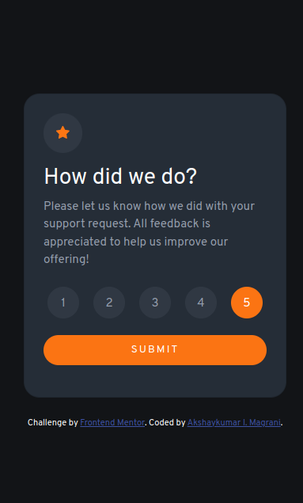

# Frontend Mentor - Interactive rating component solution

This is a solution to the [Interactive rating component challenge on Frontend Mentor](https://www.frontendmentor.io/challenges/interactive-rating-component-koxpeBUmI). Frontend Mentor challenges help you improve your coding skills by building realistic projects. 

## Table of contents

- [Overview](#overview)
  - [The challenge](#the-challenge)
  - [Screenshot](#screenshot)
  - [Links](#links)
- [My process](#my-process)
  - [Built with](#built-with)
  - [What I learned](#what-i-learned)
  - [Continued development](#continued-development)
- [Author](#author)
- [Acknowledgments](#acknowledgments)

**Note: Delete this note and update the table of contents based on what sections you keep.**

## Overview

### The challenge

Users should be able to:

- View the optimal layout for the app depending on their device's screen size
- See hover states for all interactive elements on the page
- Select and submit a number rating
- See the "Thank you" card state after submitting a rating

### Screenshot



### Links

- Solution URL: [Solution URL](https://github.com/akshaymagrani/webDev-j-interactive-rating-component)
- Live Site URL: [Live site URL](https://web-dev-j-interactive-rating-component.vercel.app/)

## My process

### Built with

- Semantic HTML5 markup
- CSS custom properties
- Flexbox
- CSS Grid
- Mobile-first workflow
- [Bootstrap](https://getbootstrap.com/docs/5.1/getting-started/introduction/) - CSS Framework
- [jQuery](https://jquery.com/) - JS library

### What I learned

Use this section to recap over some of your major learnings while working through this project. Writing these out and providing code samples of areas you want to highlight is a great way to reinforce your own knowledge.

I learnt how to apply Bootstrap utilities in various screen sizes and line heights.
Line heights can help to center the text. Here I used line-height: 1.2; to get the text in center vertically.

To see how you can add code snippets, see below:

```html
<h1>Some HTML code I'm proud of</h1>
```
modified a css variable to work with hsla - 
```css
.bg-grey{
    background-color: hsla(var(--Light-Grey), 0.1); /* Light-Grey is a CSS variable which has the value - 217, 12%, 63%;*/
    line-height: 2.2;
}
```
Applied jQuery for styling HTML elements.
```js
$('button:not([type="submit"])').click(function thankYouCard(e)
            {
                $('star').click(function(){
                    $(this).css('background-color', orange);
                });
                $(this).css({
                    'background-color': orange,
                    'color': 'white'
                });
                $(this).siblings('button:not([type="submit"])').css({
                    'background-color': 'hsla(217, 12%, 63%, 0.1)',
                    'color': 'hsl(217, 12%, 63%)'
                });
                rating = $(this).text();
                console.log(rating);
                return rating;
            }
        );
```
### Continued development

Use this section to outline areas that you want to continue focusing on in future projects. These could be concepts you're still not completely comfortable with or techniques you found useful that you want to refine and perfect.

Bootstrap layout is more powerful I have used in this project. I would like to strengthen the same by using the same in my future projects.


jQuery has a lot of scope to speed up the development. I have added comments to improve the functionality of this project by adding code to check if user has not given a rating and display an alert.

## Author

- Website - [Akshaykumar I. Magrani](https://www.your-site.com)
- Frontend Mentor - [@akshaymagrani](https://www.frontendmentor.io/profile/akshaymagrani)
- Twitter - [@akshay_magrani](https://www.twitter.com/akshay_magrani)

**Note: Delete this note and add/remove/edit lines above based on what links you'd like to share.**

## Acknowledgments

Thank you Bootstrap and jQuery development teams for the wonderful and thorough documentation which makes using the frameworks easy.
